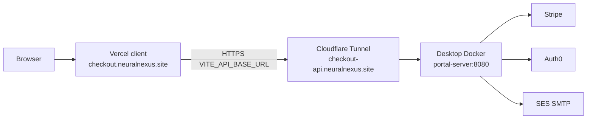

# Deploy portal client (Vercel) + desktop API (Cloudflare Tunnel)

## Target architecture



**Hostnames (project convention — adjust if you prefer differently):**
- **Client (Vercel):** `https://checkout.neuralnexus.site`
- **API (tunnel → desktop):** `https://checkout-api.neuralnexus.site`

Your DNS already has `api.neuralnexus.site` → tunnel `neuralnexus-api` for the Neural Nexus API. Use a **new** tunnel (or a new public hostname on an existing tunnel) for the **customer portal** API so the two backends stay separate.

---

## 1. Cloudflare Tunnel for the desktop portal API

In [Cloudflare Zero Trust](https://one.dash.cloudflare.com) → Networks → Tunnels:

1. Create a tunnel (e.g. `neuralnexus-checkout-api`) **or** add a hostname to an existing desktop tunnel.
2. Public hostname:
   - **Subdomain:** `checkout-api`
   - **Domain:** `neuralnexus.site`
   - **Service:** `http://portal-server:8080`  
     (Docker Compose service name on the same network as `cloudflared` in [src/server/docker-compose.yml](src/server/docker-compose.yml))
3. Cloudflare will create a proxied CNAME/Tunnel DNS record for `checkout-api.neuralnexus.site` (same pattern as `api.neuralnexus.site`).
4. Copy the tunnel **token** into [src/server/.env.dev](src/server/.env.dev) as `CLOUDFLARE_TUNNEL_TOKEN=...`.

**Compose token gotcha:** `${CLOUDFLARE_TUNNEL_TOKEN}` in compose is interpolated from the **project** env (shell or `src/server/.env`), not automatically from `env_file: .env.dev` on `portal-server`. Plan includes a small compose fix so `cloudflared` reliably gets the token from `.env.dev` (e.g. `env_file` + `environment` / `command` using the env var inside the container).

Start both services from `src/server`:

```bash
docker compose up --build
# not just portal-server — need cloudflared too
```

Verify: `https://checkout-api.neuralnexus.site/healthz` → `{"ok":true,"environment":"test"}`.

---

## 2. Server env for public use

Update [src/server/.env.dev](src/server/.env.dev) (and restart):

| Variable | Value |
|---|---|
| `CLOUDFLARE_TUNNEL_TOKEN` | from Zero Trust |
| `CLIENT_ORIGIN` | `https://checkout.neuralnexus.site,http://localhost:5171` (**production first** — Stripe Checkout return URLs use the first origin) |
| `DEV` | `FALSE` for real OTP email + real client IPs for anonymous hashing (keep `TRUE` only for local anonymous IP pinning) |
| `SMTP_*` | SES SMTP (already pointed at `email-smtp.us-east-1.amazonaws.com`) |

Desktop must stay online with Compose running for the public API to work.

---

## 3. Vercel project for the portal client (auto-deploy from `main`)

Create a **new** Vercel project (separate from `neural-nexus` / `www.neuralnexus.site`):

1. Import GitHub repo `anubis-customer-portal` (or whatever the remote is).
2. **Root Directory:** `src/client`
3. Framework: Vite ( [src/client/vercel.json](src/client/vercel.json) already has SPA rewrites).
4. Production branch: `main` → auto-deploy on merge/push.
5. Environment variable (Production + Preview as needed):
   - `VITE_API_BASE_URL` = `https://checkout-api.neuralnexus.site`  
   (must be set at **build** time — Vite inlines it.)
6. Domains → add `checkout.neuralnexus.site`:
   - Add the DNS record Cloudflare/Vercel shows (usually CNAME to `cname.vercel-dns.com`, or use Vercel’s Cloudflare integration).
   - Do **not** point `checkout.neuralnexus.site` at the tunnel.

Redeploy after setting `VITE_API_BASE_URL` so the build picks it up.

---

## 4. Wire-up checklist

- [ ] `https://checkout-api.neuralnexus.site/healthz` OK while Compose runs
- [ ] `https://checkout.neuralnexus.site` loads the portal
- [ ] Browser network tab: API calls go to `checkout-api…`, CORS succeeds (`CLIENT_ORIGIN` includes the Vercel origin)
- [ ] Sign-in OTP email works (`DEV=FALSE` + SES)
- [ ] Anonymous `/me` resolves via hashed IP (not pinned `172.18.0.1` unless `DEV=TRUE`)

---

## 5. Code / config changes in this repo (during implementation)

1. Fix [src/server/docker-compose.yml](src/server/docker-compose.yml) so `cloudflared` receives `CLOUDFLARE_TUNNEL_TOKEN` from `.env.dev`.
2. Document the two hostnames + Vercel root dir + env vars in [README.md](README.md) if anything is still ambiguous.
3. No client code changes required beyond Vercel project env ( [src/client/src/api.ts](src/client/src/api.ts) already reads `VITE_API_BASE_URL`).

---

## Out of scope / notes

- Live Stripe (`PORTAL_ENV=live` / `.env.live`) stays separate until you explicitly switch.
- Apex SPF still only lists Cloudflare; add `include:amazonses.com` when you want stronger SES alignment (mail may still work via DKIM).
- If you instead want the **API** tunnel hostname to be `checkout.neuralnexus.site` and the **client** on another name (e.g. `portal.neuralnexus.site`), say so before execution and we swap the labels above.